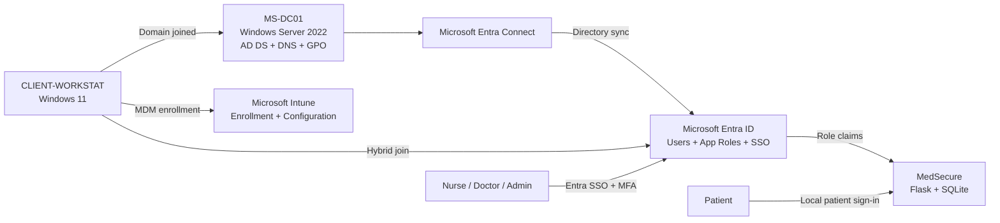
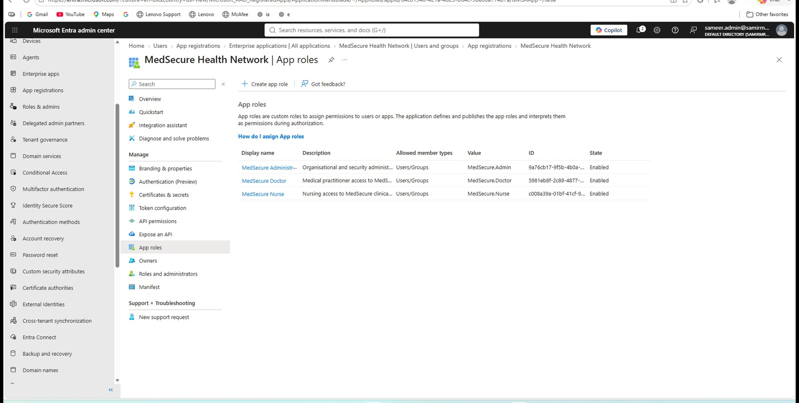
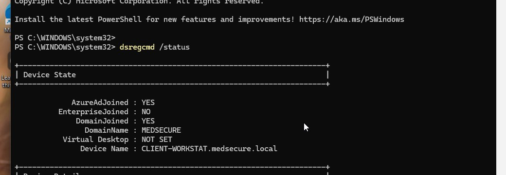

# MedSecure

**MedSecure** is an end-to-end healthcare IT lab that I built to connect infrastructure, identity, endpoint management and secure application development in one project.

**Live MedSecure demo:** https://medsecure-sam-git-main-project-beyond.vercel.app

I originally started with the web application, but I wanted to understand what would sit around an application like this in a real organisation. The project grew into a small Microsoft-based enterprise environment with Windows Server Active Directory, Group Policy, Microsoft Entra ID, hybrid identity, Intune device management, workforce SSO, MFA, application roles and a Flask healthcare portal.

> **Lab note:** All patients, staff profiles, clinical information and organisation data used in this repository are synthetic. MedSecure is an educational prototype, not a production healthcare system.


## What I built

- Windows Server 2022 domain controller (`MS-DC01`)
- Active Directory domain: `medsecure.local`
- Organisational Units for users, groups, servers and workstations
- DNS and Group Policy
- Windows 11 domain client (`CLIENT-WORKSTAT`)
- Microsoft Entra Connect synchronisation
- Microsoft Entra hybrid joined Windows client
- Microsoft Intune enrollment and remote device management
- Microsoft Entra workforce authentication for MedSecure
- Microsoft Authenticator MFA during workforce sign-in
- Entra application roles for Nurse, Doctor and Administrator
- Application-level RBAC and least-privilege controls
- Separate patient login and patient-record isolation
- Security event logging
- CSRF protection, secure response headers and login rate limiting
- Automated Pytest security tests

## Architecture



The key idea was to keep **identity authentication** and **application authorisation** separate. Microsoft Entra verifies the workforce identity. MedSecure reads the application role claim and then applies its own route-level access controls.

## Identity and access

The workforce side uses these Microsoft Entra application roles:

| Entra app role | MedSecure role | Main access |
|---|---|---|
| `MedSecure.Nurse` | Nurse | Authorised patient records and clinical workflow |
| `MedSecure.Doctor` | Doctor | Authorised patient records and clinical workflow |
| `MedSecure.Admin` | Administrator | Organisation, workforce and security administration |

Patients use a separate local patient identity and can access only the patient record linked to their account.

Administrative access is intentionally separated from clinical access. An administrator can manage the application but is blocked from patient clinical records.



## Hybrid identity

The on-premises AD environment is synchronised with Microsoft Entra using Entra Connect. The Windows client was then configured as a hybrid identity device.



The lab reached the point where the client reported both:

- `AzureAdJoined : YES`
- `DomainJoined : YES`

This allowed the same workstation to participate in the local domain while also using Microsoft cloud identity and management services.

## Intune endpoint management

After hybrid join, I configured Group Policy based automatic MDM enrollment and enrolled `CLIENT-WORKSTAT` into Microsoft Intune.

The device became visible as a corporate Windows device, could be remotely synchronised, and successfully received an Intune configuration profile.


The `MedSecure - Display Control` profile reporting **Succeeded: 1** is the final proof in this lab that the enrolled endpoint was receiving configuration from Intune.

## MedSecure application

The application is written in Python using Flask and SQLAlchemy with SQLite for the lab database.

**Live demo:** https://medsecure-sam-git-main-project-beyond.vercel.app

Workforce authentication is handled through Microsoft Entra ID. The application requires exactly one recognised MedSecure app role and maps that role to the corresponding local application profile.


The application includes:

- Nurse, Doctor, Administrator and Patient experiences
- patient worklists
- clinical record access
- allergy awareness
- organisation and workforce administration
- security event logging
- role-aware navigation
- least-privilege access controls

## Security controls

MedSecure includes several controls directly in the Flask application:

- CSRF protection with Flask-WTF
- password hashing with Werkzeug
- login rate limiting
- `X-Content-Type-Options: nosniff`
- `X-Frame-Options: DENY`
- Content Security Policy
- no-cache response policy for sensitive pages
- server-side security event logging
- route-level RBAC
- patient-record isolation
- administrative least privilege
- tenant and app-role checks for Entra workforce sign-in

Automated tests cover authentication, patient isolation, admin least privilege, nurse access, security-log restrictions, security headers and brute-force rate limiting.

```bash
python -m pytest -v
bandit -r app.py
pip-audit
```

## Troubleshooting was part of the project

A large part of this lab was getting the pieces to work together rather than simply installing them.

Some examples:

- the Windows client was originally in AD's default `Computers` container, so the Intune auto-enrollment GPO linked to my custom workstation OU was not applying
- I moved the client into the correct `MEDSECURE/COMPUTERS/Workstations` OU and verified Group Policy again
- the Intune `EnterpriseMgmt` enrollment task was created, which confirmed the GPO had reached the client
- enrollment then failed because the signed-in account did not have the required Intune entitlement
- I configured the synced workforce user's usage location, assigned an Intune Plan 1 licence and retried enrollment
- the device then appeared in Intune, synchronised successfully and received the configuration profile
- while testing Entra application roles, an older browser session held stale role claims; testing with a fresh authentication session confirmed the updated role assignment

I kept these details because they show the actual integration work behind the screenshots rather than only the final state.

More detail is in [docs/06-troubleshooting-notes.md](docs/06-troubleshooting-notes.md).

## Documentation

- [Hybrid infrastructure](docs/01-hybrid-infrastructure.md)
- [Identity and access](docs/02-identity-and-access.md)
- [Intune endpoint management](docs/03-endpoint-management.md)
- [MedSecure application](docs/04-medsecure-application.md)
- [Security and testing](docs/05-security-and-testing.md)
- [Troubleshooting notes](docs/06-troubleshooting-notes.md)

## Evidence

The `screenshots/` directory is organised in the same order as the build:

```text
screenshots/
├── 01-architecture
├── 02-windows-server-ad
├── 03-domain-client-gpo
├── 04-entra-id
├── 05-hybrid-identity
├── 06-intune
└── 07-medsecure-login
```

Screenshots were curated before publishing. Environment-specific identifiers that were not useful to the portfolio were cropped or redacted.

## Running the application locally

Create a virtual environment and install the dependencies:

```powershell
python -m venv .venv
.\.venv\Scripts\Activate.ps1
pip install -r requirements.txt
```

Create a `.env` file locally. Do **not** commit real secrets.

```env
SECRET_KEY=replace-with-a-random-secret
ENTRA_CLIENT_ID=your-client-id
ENTRA_TENANT_ID=your-tenant-id
ENTRA_CLIENT_SECRET=your-client-secret
ENTRA_REDIRECT_URI=http://localhost:5000/auth/callback
```

Then run:

```powershell
python app.py
```

## Current scope

This repository is a lab and portfolio project. It intentionally uses SQLite and local development settings. A production healthcare deployment would need additional work such as production HTTPS, a managed database, centralised session storage, formal secrets management, backup and recovery controls, monitoring, compliance review and a broader threat model.

---

Built as a hands-on project to learn how **Windows infrastructure, Microsoft identity, endpoint management and secure application development** fit together as one system.
