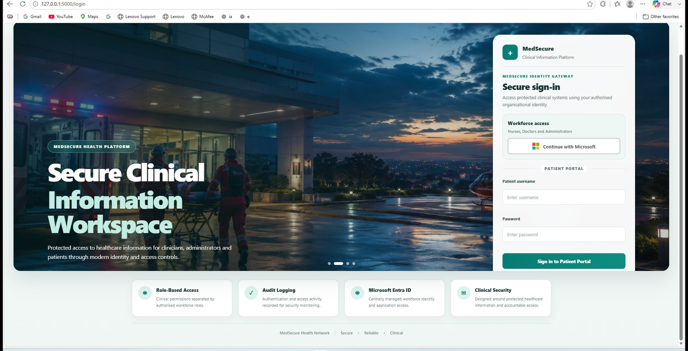
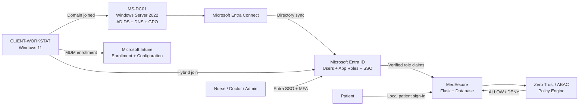
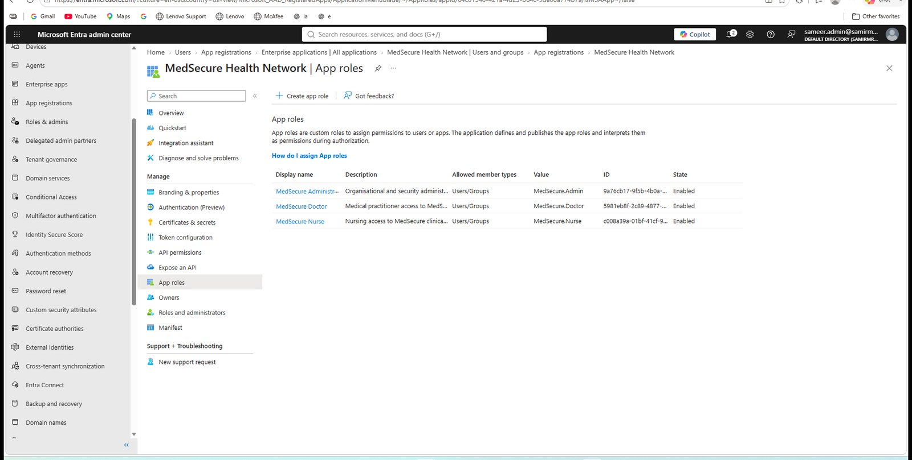
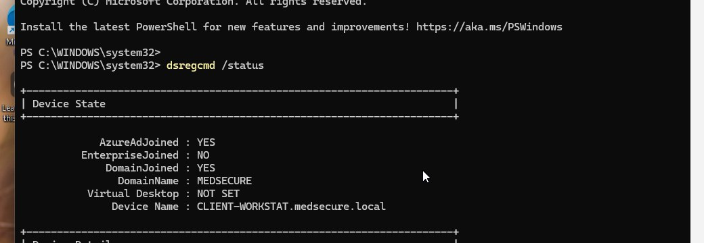
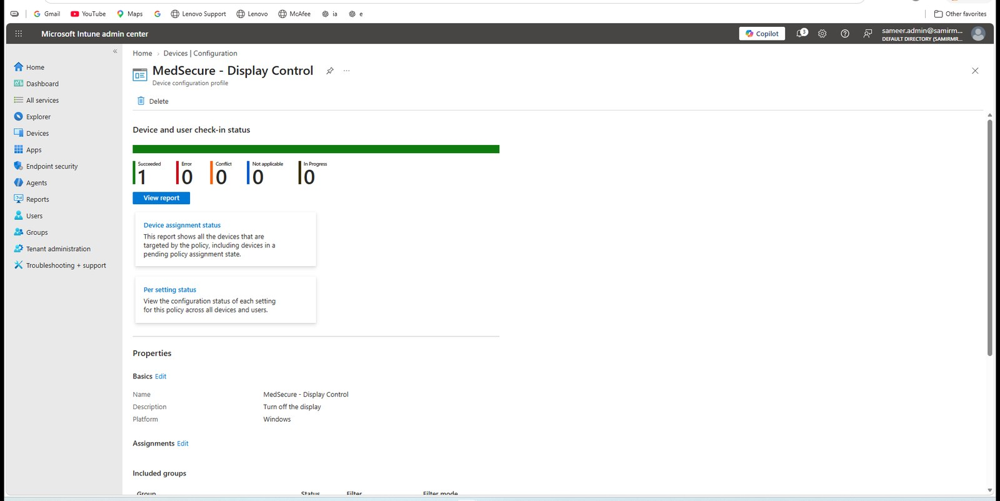
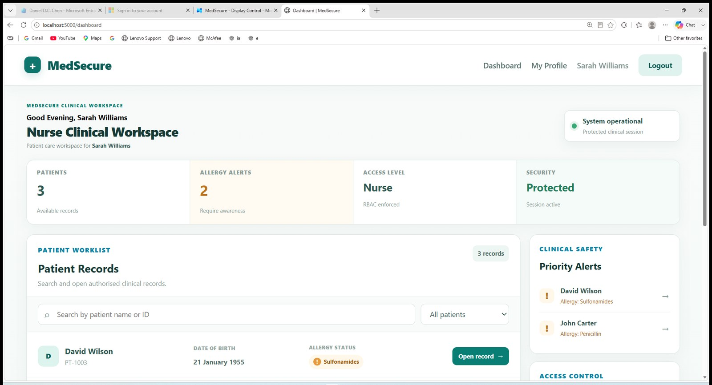

# MedSecure

**MedSecure** is an end-to-end healthcare IT lab that connects infrastructure, identity, endpoint management, secure application development and security assurance in one project.

**Live MedSecure demo:** https://medsecure-sam-git-main-project-beyond.vercel.app

The project combines a Microsoft-based enterprise environment with a Flask healthcare portal, workforce SSO/MFA, application roles, least privilege, Zero Trust / ABAC policy checks, security logging and an automated DevSecOps security pipeline.

> **Lab note:** All patients, staff profiles, clinical information and organisation data used in this repository are synthetic. MedSecure is an educational prototype, not a production healthcare system.



## What I built

- Windows Server 2022 domain controller (`MS-DC01`)
- Active Directory domain: `medsecure.local`
- Organisational Units for users, groups, servers and workstations
- DNS and Group Policy
- Windows 11 domain client (`CLIENT-WORKSTAT`)
- Microsoft Entra Connect synchronisation
- Microsoft Entra hybrid joined Windows client
- Microsoft Intune enrollment and remote device management
- Microsoft Entra workforce authentication for MedSecure
- Microsoft Authenticator MFA during workforce sign-in
- Entra application roles for Nurse, Doctor and Administrator
- Application-level RBAC and administrative least privilege
- Separate patient login and patient-record isolation
- Zero Trust / ABAC policy engine for protected resources
- Security-event and policy-decision audit logging
- CSRF protection, security headers, password hashing and login rate limiting
- Automated pytest security regression tests
- Bandit SAST, pip-audit dependency scanning and Gitleaks secrets scanning
- OWASP ZAP dynamic testing and Nmap attack-surface validation in an authorised eduLAB
- GitHub Actions security pipeline with an automated security gate

## Architecture


```mermaid
flowchart LR
    DC["MS-DC01<br/>Windows Server 2022<br/>AD DS + DNS + GPO"]
    PC["CLIENT-WORKSTAT<br/>Windows 11"]
    CONNECT["Microsoft Entra Connect"]
    ENTRA["Microsoft Entra ID<br/>Users + App Roles + SSO"]
    INTUNE["Microsoft Intune<br/>Enrollment + Configuration"]
    APP["MedSecure<br/>Flask + Database"]
    POLICY["Zero Trust / ABAC<br/>Policy Engine"]
    STAFF["Nurse / Doctor / Admin"]
    PATIENT["Patient"]

    PC -->|Domain joined| DC
    DC --> CONNECT
    CONNECT -->|Directory sync| ENTRA
    PC -->|Hybrid join| ENTRA
    PC -->|MDM enrollment| INTUNE
    STAFF -->|Entra SSO + MFA| ENTRA
    ENTRA -->|Verified role claims| APP
    PATIENT -->|Local patient sign-in| APP
    APP --> POLICY
    POLICY -->|ALLOW / DENY| APP
```

The design separates **authentication** from **application authorisation**. Microsoft Entra verifies workforce identity. MedSecure then applies application-level least privilege and Zero Trust / ABAC policy decisions to protected resources.

## Identity and access

The workforce side uses Microsoft Entra application roles:

| Entra app role | MedSecure role | Main access |
|---|---|---|
| `MedSecure.Nurse` | Nurse | Authorised clinical workflow |
| `MedSecure.Doctor` | Doctor | Authorised clinical workflow |
| `MedSecure.Admin` | Administrator | Organisation, workforce and security administration |

Patients use a separate local patient identity and can access only the patient record linked to their account.

Administrative access is intentionally separated from clinical access. An administrator can manage the application but is blocked from patient clinical records.



## Hybrid identity

The on-premises AD environment is synchronised with Microsoft Entra using Entra Connect. The Windows client was configured as a hybrid identity device.



The lab reached the point where the client reported both:

- `AzureAdJoined : YES`
- `DomainJoined : YES`

## Intune endpoint management

After hybrid join, Group Policy based automatic MDM enrollment was configured and `CLIENT-WORKSTAT` was enrolled into Microsoft Intune.



The `MedSecure - Display Control` profile reporting **Succeeded: 1** provides evidence that the enrolled endpoint received the assigned configuration.

## MedSecure application

The application is written in Python using Flask and SQLAlchemy.

Workforce authentication is handled through Microsoft Entra ID. The application requires exactly one recognised MedSecure app role and maps that role to the corresponding application profile.



The application includes:

- Nurse, Doctor, Administrator and Patient experiences
- patient worklists and protected clinical record access
- allergy awareness
- organisation and workforce administration
- security-event logging
- role-aware navigation
- least-privilege controls
- Zero Trust / ABAC policy decisions for protected resources

## Security controls

MedSecure includes:

- CSRF protection with Flask-WTF
- Werkzeug password hashing
- login rate limiting
- HTTP-only and SameSite session cookies
- `X-Content-Type-Options: nosniff`
- `X-Frame-Options: DENY`
- Content Security Policy
- restrictive Permissions Policy
- no-cache response policy for sensitive pages
- server-side security-event logging
- RBAC and patient-record isolation
- administrative least privilege
- tenant and app-role checks for Entra workforce sign-in
- deny-by-default Zero Trust / ABAC policy checks
- explainable `ZT_POLICY` audit events with decision latency

The final automated security regression suite contains **11 tests**.

```bash
python -m pytest -v
bandit -r app.py
pip-audit
gitleaks git .
```

The GitHub Actions workflow automatically performs build/syntax validation, Bandit, pytest, pip-audit, Gitleaks and a final security gate. CI test credentials are generated ephemerally per workflow run instead of being stored as reusable passwords in the repository.

## Security assessment highlights

Authorised ICT932 testing included:

- Bandit: 2 Low B110 findings remediated; final scan reported no issues
- pip-audit: 8 known vulnerabilities reported in `setuptools 59.6.0`; final scan clean after upgrade and regression testing
- pytest: 8 original tests extended to 11 after Zero Trust / ABAC validation
- OWASP ZAP: automated traffic exercised the running application; login rate limiting returned HTTP 429
- Nmap: attack-surface discovery and service attribution inside the authorised eduLAB
- Gitleaks: no leaks found
- Broken Access Control: cross-patient request returned HTTP 403
- Login abuse: repeated failures triggered containment and later successful recovery
- Injection: tested SQL injection-style login payload did not bypass authentication
- Zero Trust / ABAC: central policy decisions logged with explicit ALLOW/BLOCKED reasons

See [ICT932 security assessment evidence](docs/07-ict932-security-assessment.md) for the full testing and remediation register.

## Troubleshooting was part of the project

A large part of the lab involved integration and fault isolation rather than simply installing components.

Examples include:

- moving the Windows client from AD's default `Computers` container into the correct workstation OU so the Intune auto-enrollment GPO applied
- resolving Intune enrollment entitlement issues
- validating hybrid join and MDM enrollment
- confirming updated Entra application-role claims with a fresh authentication session
- distinguishing network reachability from application/service behaviour
- interpreting scanner findings before treating them as confirmed vulnerabilities

More detail is in [docs/06-troubleshooting-notes.md](docs/06-troubleshooting-notes.md).

## Documentation

- [Evidence inventory](docs/00-evidence-inventory.md)
- [Hybrid infrastructure](docs/01-hybrid-infrastructure.md)
- [Identity and access](docs/02-identity-and-access.md)
- [Intune endpoint management](docs/03-endpoint-management.md)
- [MedSecure application](docs/04-medsecure-application.md)
- [Security and testing](docs/05-security-and-testing.md)
- [Troubleshooting notes](docs/06-troubleshooting-notes.md)
- [ICT932 security assessment evidence](docs/07-ict932-security-assessment.md)
- [Security and responsible-testing policy](SECURITY.md)

## Evidence and privacy

The public `screenshots/` tree contains curated evidence. Raw assessment screenshots are kept outside Git tracking until reviewed because browser and eduLAB captures may contain unnecessary account identifiers, student IDs, device/tenant details or other context.

Before publishing new evidence:

- redact student/account identifiers
- remove secrets, tokens, real passwords, session data and MFA challenge details
- keep only the minimum context necessary to prove the result
- use synthetic data only

## Running the application locally

Create a virtual environment and install the dependencies:

```powershell
python -m venv .venv
.\.venv\Scripts\Activate.ps1
pip install -r requirements.txt
```

Create a `.env` file locally. Do **not** commit real secrets.

```env
SECRET_KEY=replace-with-a-random-secret
ENTRA_CLIENT_ID=your-client-id
ENTRA_TENANT_ID=your-tenant-id
ENTRA_CLIENT_SECRET=your-client-secret
ENTRA_REDIRECT_URI=http://localhost:5000/auth/callback
DEMO_PATIENT_PASSWORD=use-a-local-synthetic-value
DEMO_NURSE_PASSWORD=use-a-local-synthetic-value
DEMO_DOCTOR_PASSWORD=use-a-local-synthetic-value
DEMO_ADMIN_PASSWORD=use-a-local-synthetic-value
```

Then run:

```powershell
python app.py
```

## Current scope

This repository is a lab and portfolio project. A production healthcare deployment would require additional work including production HTTPS, managed secrets, a managed database, centralised logging/SIEM, monitored backups, disaster recovery, broader DAST, privacy/compliance review and operational hardening.

---

Built as a hands-on project to learn how **Windows infrastructure, Microsoft identity, endpoint management, secure application development, security testing and DevSecOps** fit together as one system.
