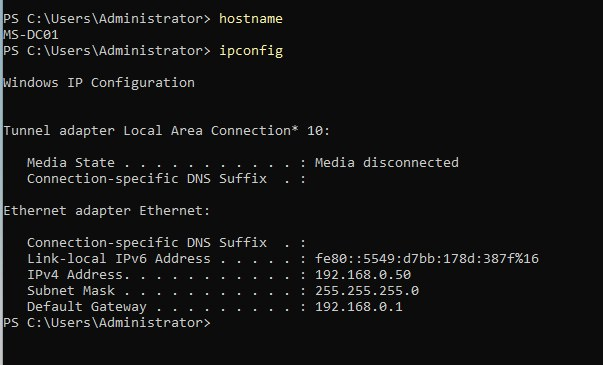
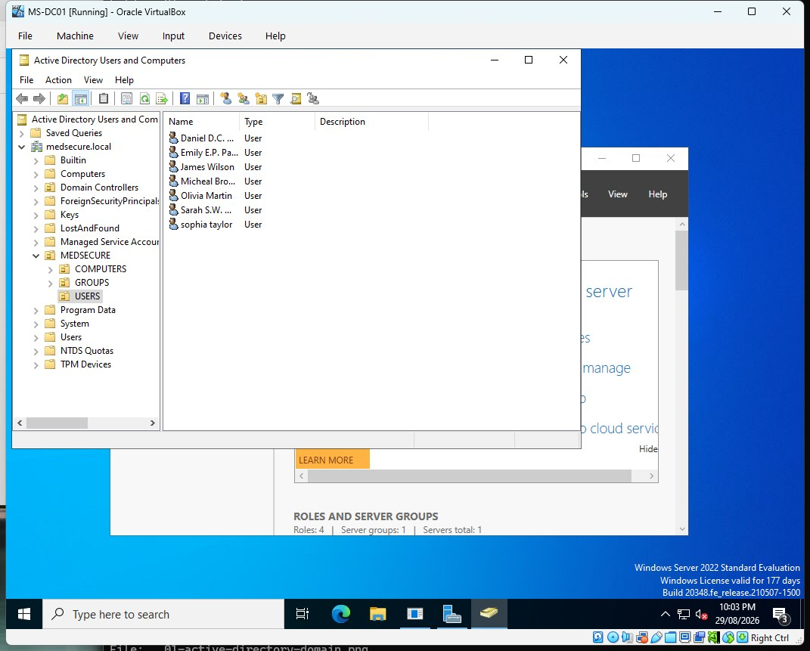
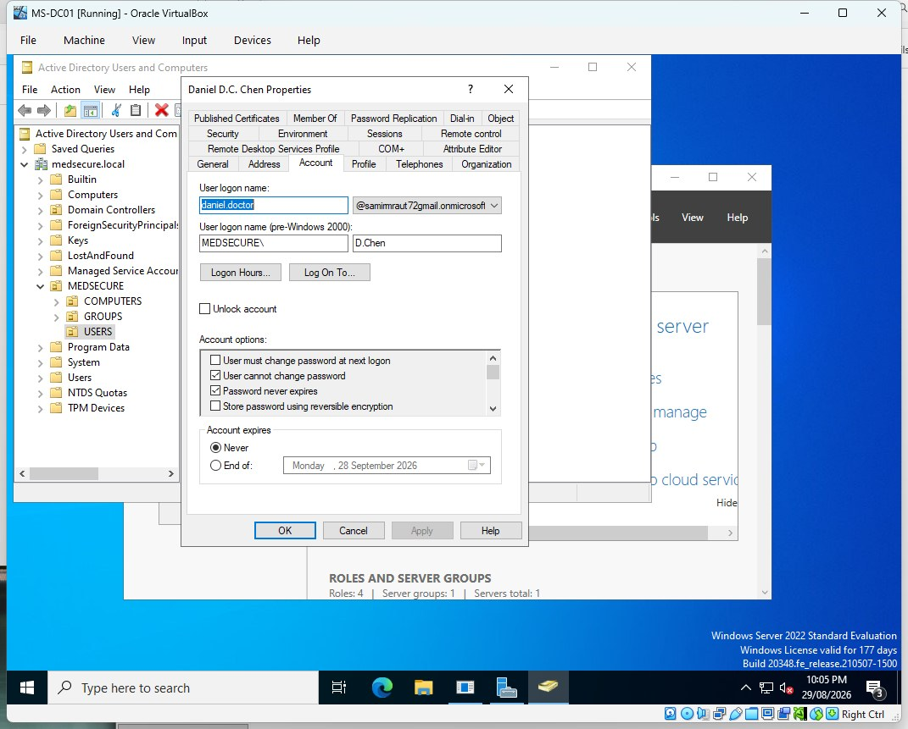
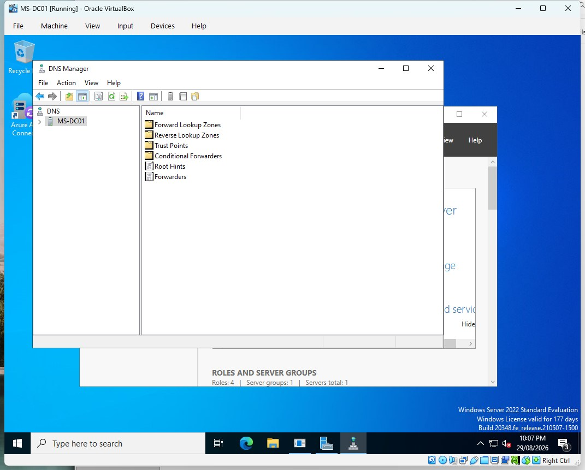
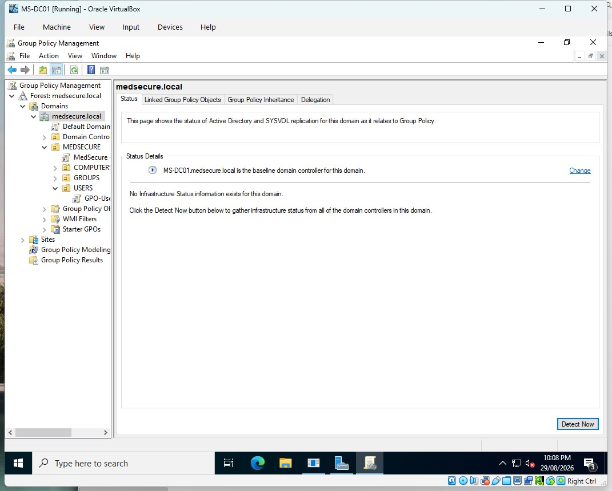
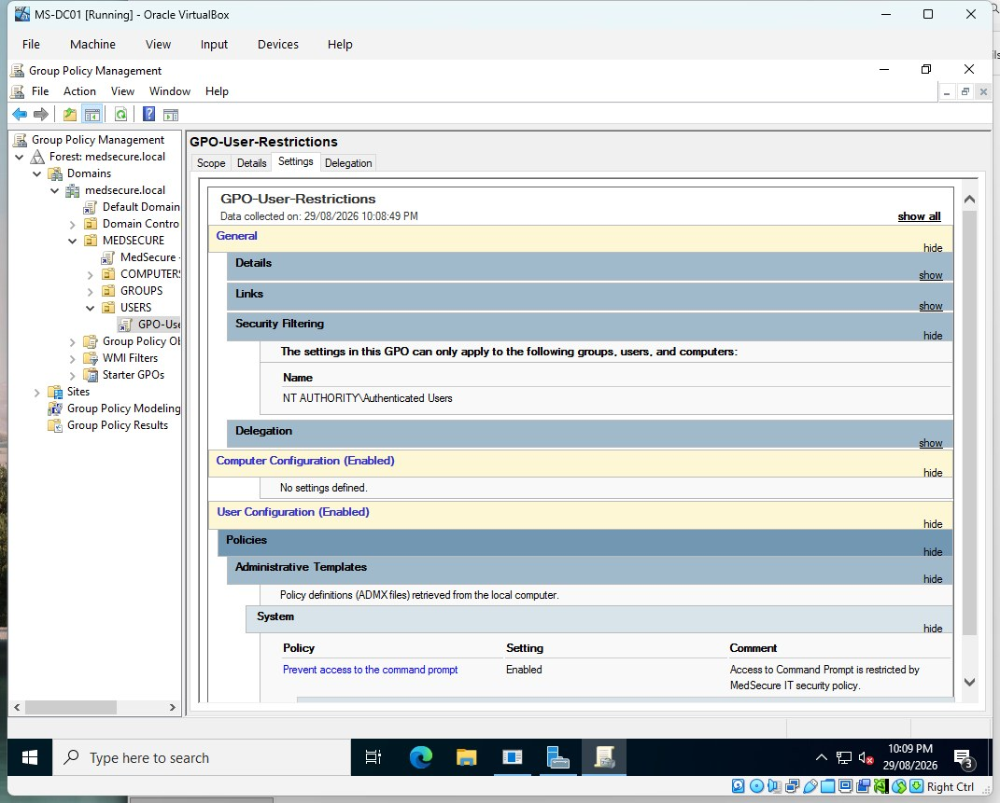
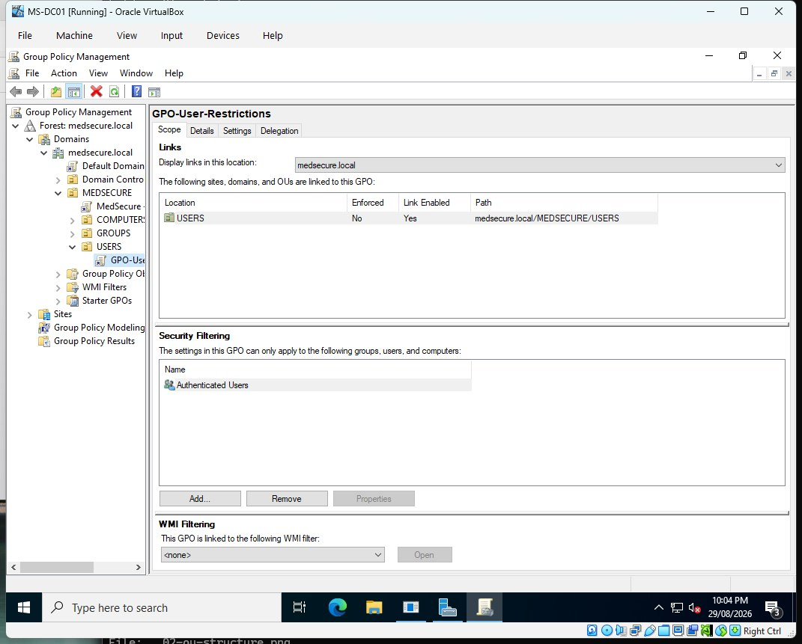
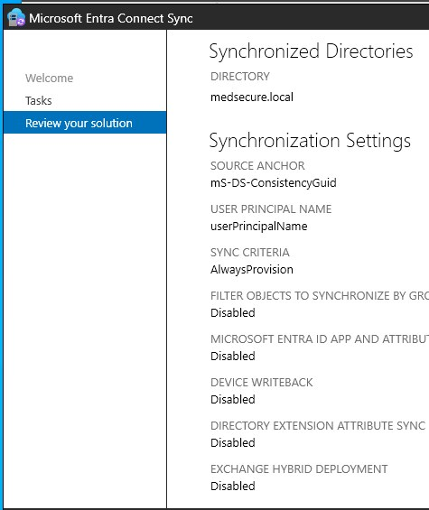
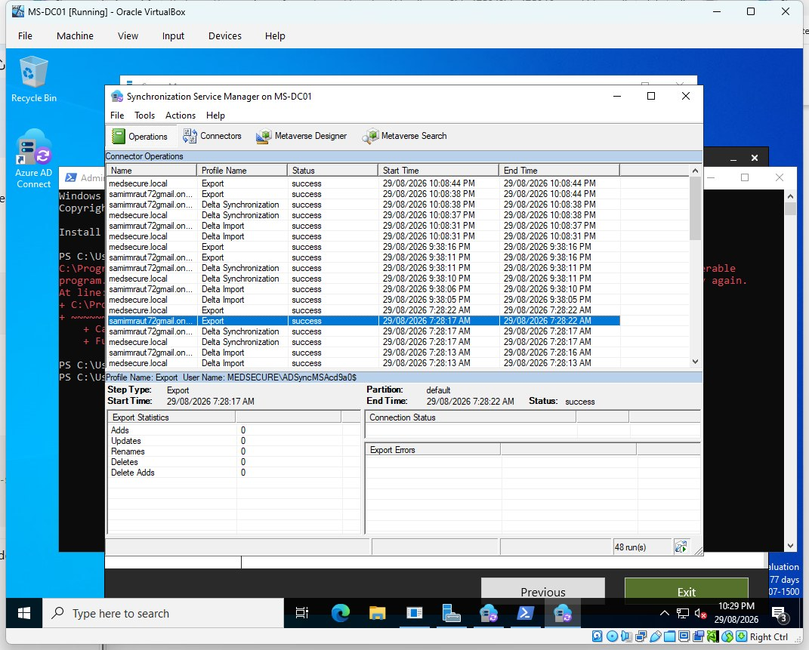
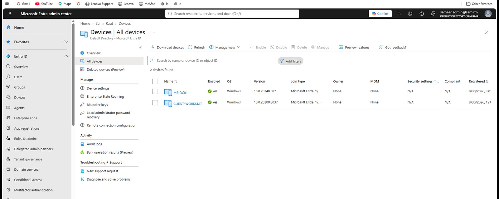

# Hybrid Infrastructure

This part of the project started with a small Windows domain and then extended it into Microsoft cloud identity.

## On-premises lab

The lab uses:

- `MS-DC01` — Windows Server 2022 domain controller
- `CLIENT-WORKSTAT` — Windows 11 client
- Active Directory domain — `medsecure.local`
- Active Directory Domain Services
- DNS
- Group Policy

The client and server were placed on the same lab LAN. The domain controller uses a fixed address so the client can reliably locate domain services.

## Active Directory structure

I created a `MEDSECURE` OU structure to keep users, groups, servers and workstations separate instead of leaving everything in the default AD containers.

Workforce accounts were created in Active Directory and later aligned with their Microsoft Entra identities.

Examples from the lab:

## DNS

The domain controller also provides DNS for the `medsecure.local` environment.

## Group Policy

Group Policy was used to apply workstation/user controls and later to trigger Intune automatic MDM enrollment.

One of the security policies restricts Command Prompt access for the targeted user scope.

The user restriction GPO is linked to the MedSecure users OU.

## Entra Connect

Microsoft Entra Connect synchronises the on-premises directory with Microsoft Entra ID.

The Synchronization Service Manager was used to confirm successful directory synchronisation operations.

## Hybrid join

After the identity synchronisation and device configuration were in place, the Windows client appeared in Microsoft Entra.

I then verified the Windows device state locally with `dsregcmd /status`.

The important result was that the client was both domain joined and Azure/Entra joined, which is the hybrid state I wanted for the lab.
