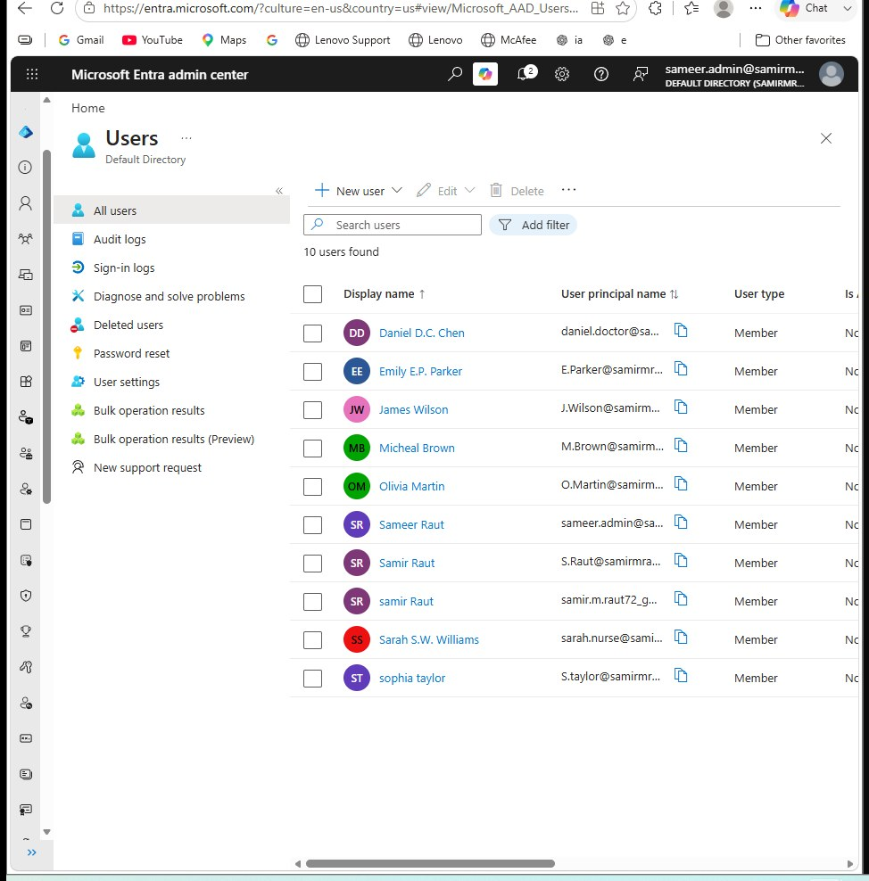
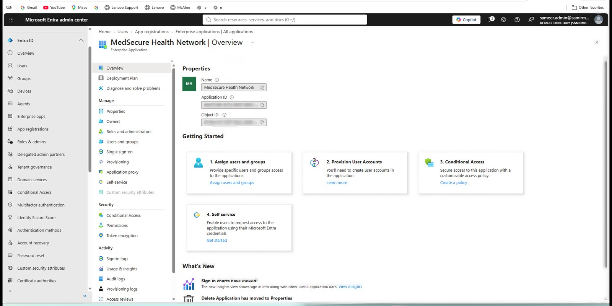
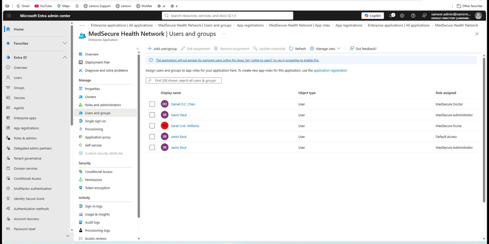
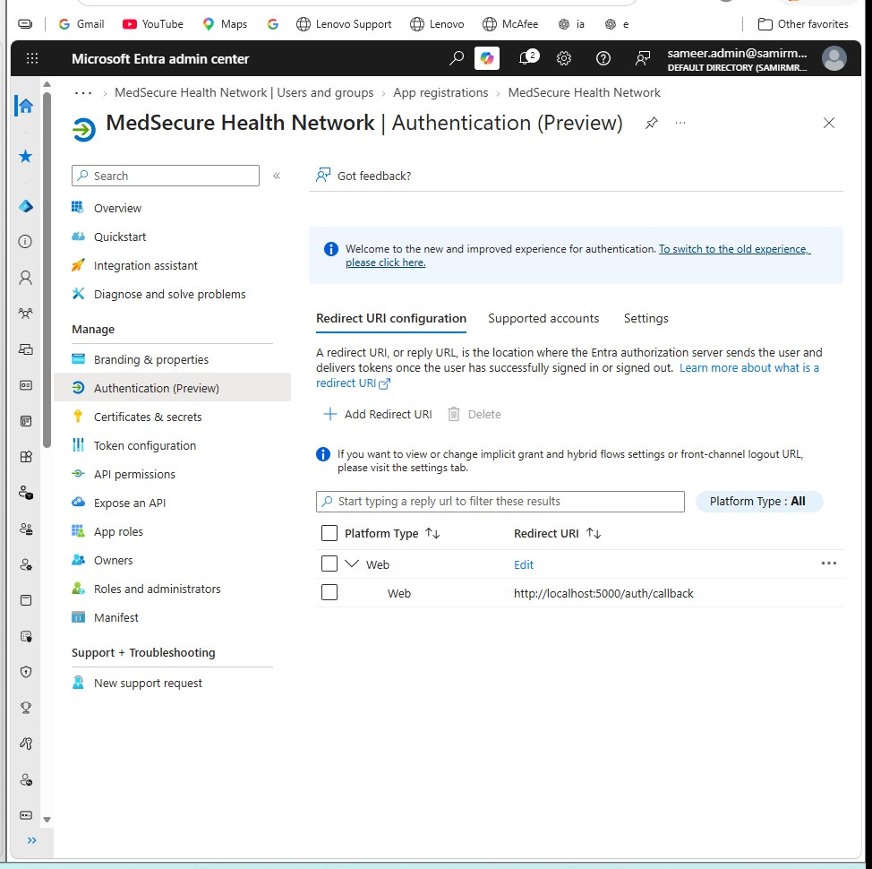
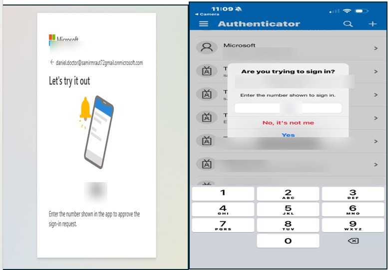

# Identity and Access

MedSecure uses Microsoft Entra ID for workforce authentication while keeping application authorisation inside the Flask application.

## Why I separated authentication and authorisation

I did not want the application to treat a successful Microsoft login as unlimited access.

The flow is:

1. Microsoft Entra authenticates the workforce user.
2. The Entra token contains a MedSecure application role.
3. MedSecure accepts only recognised application roles.
4. The role is mapped to a local application profile.
5. Flask route controls enforce what that role can actually access.

This creates a clear boundary between **who the person is** and **what the application allows them to do**.

## Entra directory

The lab contains workforce identities for the different clinical and administrative roles.



## MedSecure enterprise application

MedSecure is registered with Microsoft Entra and configured for workforce sign-in.



Environment-specific application identifiers were deliberately hidden in the published evidence because they add no value to the portfolio.

## Application roles

The Entra application defines three workforce roles:

- `MedSecure.Nurse`
- `MedSecure.Doctor`
- `MedSecure.Admin`


The roles are then assigned to the relevant workforce identities.



## Authentication configuration

The application uses a web redirect URI for the Flask authentication callback.



## MFA

I also tested Microsoft Authenticator number matching during workforce authentication.



The published image is intentionally redacted. It is meant to show the authentication flow, not expose email addresses or a sign-in challenge.

## Application-side role enforcement

In `app.py`, MedSecure maps the Entra role claims to local roles:

```python
ENTRA_ROLE_MAP = {
    "MedSecure.Nurse": "nurse",
    "MedSecure.Doctor": "doctor",
    "MedSecure.Admin": "admin",
}
```

The application intentionally requires exactly one recognised MedSecure role to avoid ambiguous privilege selection.

It also checks that the token belongs to the configured tenant before establishing the application session.

## Least privilege

Application roles are deliberately separated:

- patients can access only their linked record
- nurses and doctors can access authorised clinical records
- administrators can manage workforce, organisation and security functions
- administrators are blocked from clinical patient records

That last point was intentional. Being an application administrator does not automatically make someone a clinician.
