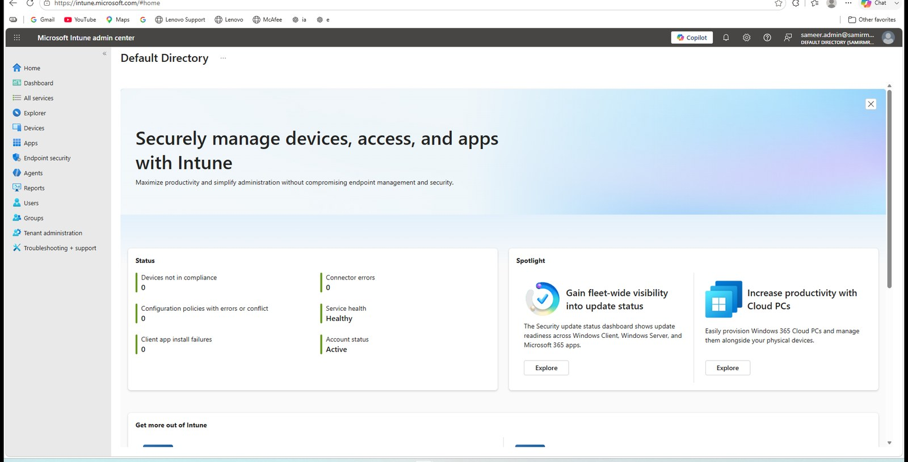
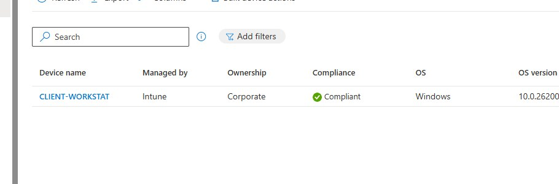
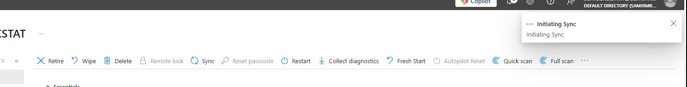
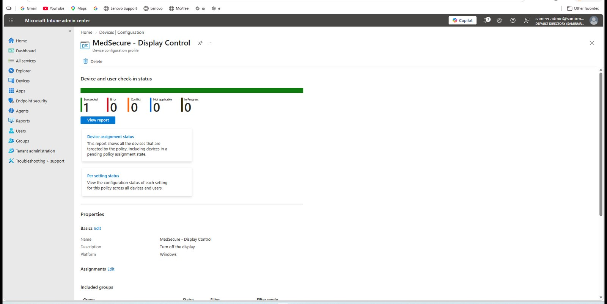

# Intune Endpoint Management

The Intune section became one of the most useful parts of this lab because it forced me to connect Active Directory OU design, Group Policy, Entra identity, licensing and Windows MDM enrollment.

## Enrollment path

The final path was:

```text
CLIENT-WORKSTAT
    ↓
Active Directory Workstations OU
    ↓
Intune auto-enrollment GPO
    ↓
Microsoft Entra hybrid join
    ↓
Licensed Entra workforce user
    ↓
Windows EnterpriseMgmt enrollment
    ↓
Microsoft Intune
```

## Intune tenant



## Managed Windows client

After resolving the enrollment issues, `CLIENT-WORKSTAT` appeared in Intune as a corporate Windows endpoint.



The published screenshot is cropped so that the evidence focuses on device management state rather than user-identifying fields.

## Remote sync

I used the Intune **Sync** action to trigger an immediate device check-in.



## Configuration profile

To prove that the device was not only enrolled but actually receiving configuration, I created a small Windows settings profile named:

`MedSecure - Display Control`

The profile was assigned to all enrolled devices in the lab. Because this tenant had one managed Windows client, the result was easy to verify.



The final result showed:

- Succeeded: 1
- Error: 0
- Conflict: 0
- Not applicable: 0
- In progress: 0

That was the point where I considered the Intune portion of the lab complete.
