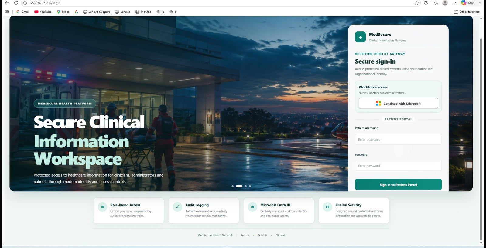
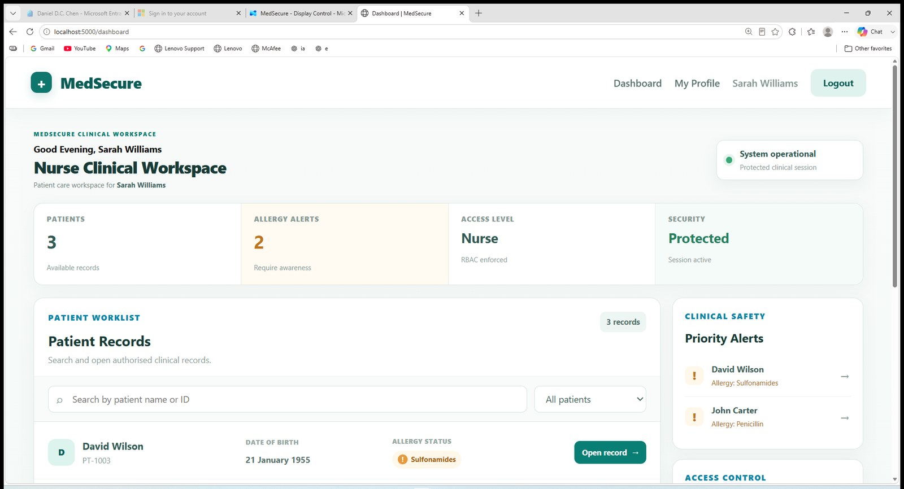

# MedSecure Application

MedSecure is a Flask healthcare information management prototype built around role separation and auditable access.

## Login experience

The public login page separates workforce sign-in from patient sign-in.



Workforce users authenticate through Microsoft Entra ID. Patients use a local patient portal identity in the prototype.

## Workforce SSO

After Microsoft authentication and role validation, the user is sent into the workspace that matches the application role.



The nurse workspace includes a patient worklist, allergy awareness and protected clinical-session indicators.

## Application structure

The prototype contains models for:

- patients
- users
- employee profiles
- organisations
- facilities
- departments
- security events

The workforce profile is kept separate from authentication. This lets the application keep business/employee information while Microsoft Entra handles the external workforce identity.

## Entra role mapping

The Flask application accepts three workforce app roles:

```python
ENTRA_ROLE_MAP = {
    "MedSecure.Nurse": "nurse",
    "MedSecure.Doctor": "doctor",
    "MedSecure.Admin": "admin",
}
```

A verified role is mapped to the corresponding application profile. MedSecure then continues to use its own route-level RBAC.

## Patient isolation

Patients have a separate relationship to a patient record. The security tests verify that one patient can access their own record but receives HTTP 403 when attempting to access another patient's record.

## Administrative separation

The admin workspace is for identity, organisation, workforce and security administration.

The application deliberately blocks admin accounts from clinical patient records. This is a simple example of least privilege: administrative responsibility does not automatically grant clinical access.

## Current implementation

The lab currently uses:

- Python
- Flask
- Flask-Login
- Flask-SQLAlchemy
- Flask-WTF / CSRF
- Flask-Limiter
- Microsoft identity integration
- SQLite

The current settings are appropriate for a local educational lab. A production deployment would need HTTPS, secure production session storage, central secrets management and a production-grade database.
